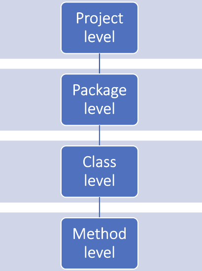
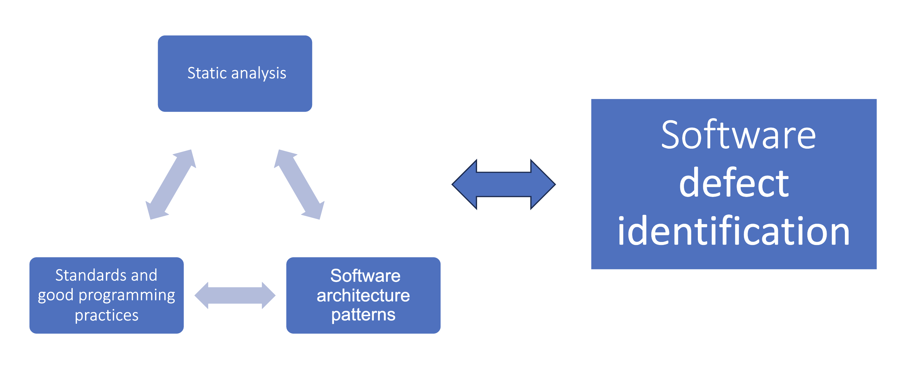

# Theoretical foundations of static code metrics

Hello everyone! Today, I'm excited to explore the topic of static code metrics in software engineering. 
This is a captivating field that merits attention,
particularly because many developers are not fully aware of the advantages that static metrics can offer.

&nbsp;
## Table of Contents

1. [Definitions](#definitions)
   1. [Classification of static metrics](#classification-of-static-metrics)
   2. [Some popular static metrics](#some-popular-static-metrics)
      1. [Method level](#method-level)
      2. [Class level](#class-level)
      3. [Package level](#package-level)
      4. [Project level](#project-level)
2. [Importance of static metrics](#importance-of-static-metrics)
3. [Popular tools for static metrics (Java)](#popular-tools-for-static-metrics-java)
4. [Summary](#summary)

&nbsp;
## Definitions

Generally speaking, we have two main types of code metrics: **static** and **dynamic** metrics.
**Dynamic metrics** are those that require running the code to obtain results, such as test coverage, JVM metrics, or business metrics in Grafana.
**Static metrics**, simply put, are all the metrics that can be obtained without running the code.

Let's think about a simple metric that we can determine without running the code (for example, having the code only in a notepad).
In this way, we can define, for example, the number of lines of code. Or the number of classes, or the number of occurrences of the keyword "if".
We can also define something more ambitious, such as cyclomatic complexity, or computational methods.

All the above examples are static metrics - besides these, we have many other metrics.
Only our imagination limits us; there are practically infinitely many.

Simple? Simple.

Of course, not every static metric is equally useful, but that's a topic for another discussion.

### Classification of static metrics

Static metrics can be divided into several categories. A common method of classification is based on the scope they impact.
The diagram below illustrates this classification well:

Examples of metrics from each category will be discussed in the section below.

&nbsp;
### Some popular static metrics

Let's now discuss the most popular static metrics that are used in practice. 
We will categorize them according to the classification provided in the previous section.

#### Method level

At the method level, we can measure various aspects, such as the following examples:
- Cyclomatic Complexity, Cognitive Complexity
- LoC (Lines of Code)
- number of arguments, number of local variables, number of conditional statements, number of loop statements, return type
- method invocations, method calls
- and many, many more...

#### Class level

At the class level, we can measure among others:
- number of methods, number of fields
- LoC (Lines of Code)
- average complexity of methods
- number of dependencies between classes (and related classes)
- number of class and method invocations

#### Package level

The package level primarily analyzes the sum/average of class metrics within the package.
This means the measures of classes and methods that are contained within a specific package.

#### Project level

And finally, the project level, which analyzes metrics across the entire project.
This can be done, for example, by aggregating metrics from all package levels.

--

The aim of this post is not to describe all metrics, but rather to highlight which metrics are
often used. A more comprehensive discussion of individual metrics can easily be found on the internet.

Definitions of some of them
can be found in the README of the project [CK](https://github.com/mauricioaniche/ck),
which is one of the tools for calculating static metrics for Java language projects. 
This tool will be briefly described in one of the upcoming sections of this post.

&nbsp;
## Importance of static metrics

Static metrics are somewhat underrated in the IT world. When it comes to dynamic metrics,
everyone knows they play an important role in the software development process. After deploying an application
to the production environment, we look at charts and evaluate the performance and efficiency of our code in action based on the data.

Static metrics are equally important, but their role is somewhat different. There are many scientific publications
that point to specific advantages of this type of metrics.

It turns out that well-maintained static metrics lead to a reduction in the number of errors in the code.
Tools that use machine learning can predict, based solely on static metrics, which
parts of the code are more prone to errors - and which should be particularly noted during refactoring.

Moreover, it appears that there is a correlation between static metrics and design patterns.
The paper [*Design Pattern Detection using Software Metrics and Machine Learning*](https://www.researchgate.net/publication/266384845_Design_Pattern_Detection_using_Software_Metrics_and_Machine_Learning)
presents such a connection.

The diagram below illustrates the main relationships associated with static code metrics:

An additional relationship concerns the identification of software defects based on static metrics. As of today, there are several hundred thousand
[scientific articles](https://scholar.google.com/scholar?hl=pl&as_sdt=0%2C5&q=defect+prediction+with+static+analysis)
that describe various techniques and tools for defect identification based on this type of metrics. 
Many of them demonstrate strong capabilities in predicting software errors.

All of the above information (which I have briefly mentioned, 
and I encourage you to delve deeper into the topic by reading the most popular scientific articles in this field) 
indicates that static metrics are important and worth using in practice. 
Although sometimes we may not see the sense in caring about the suggested values of metrics such as Cyclomatic Complexity, 
the number of arguments in a method, the length of a given method, 
or the number of local variables - it is worthwhile to pay attention to them.

&nbsp;
## Popular tools for static metrics (Java)

I would like to introduce two popular tools for calculating static metrics in Java that I personally use.

The first one is [**SonarQube**](https://www.sonarqube.org/). It is the most popular tool for static code analysis (not just for Java).
SonarQube offers a wide range of metrics, also specific to the programming language. In addition to static code metrics,
it also builds reports with dynamic metrics (like code coverage) and identifies security gaps in applications.
Thanks to its extensive features, we can generate reports, charts, and also analyze trends in our code.
The entire system can be integrated with CI/CD, which allows for the automation of the code analysis process.
SonarQube also offers a free plan, so feel free to start using this tool in your project right now!

The second tool I would like to recommend, which is definitely less well-known, is [**CK**](https://github.com/mauricioaniche/ck).
CK is a tool for calculating static metrics solely for Java projects. It is characterized by its simplicity and speed of operation.
It does not have as many advanced features as SonarQube, but it generates many useful metrics at the class and method levels.
More information about CK and the metrics it can measure can be found in the project's README on GitHub.
The report from CK is in a fairly raw state (generated in CSV format), so it may not be as suitable for daily work as SonarQube.
However, it is a great tool for experimenting with static metrics, especially in the context of academic research.

&nbsp;
## Summary

Static code analysis is an important (and still underrated) tool in the software development process.
Static metrics allow for assessing code quality, identifying potential errors, and analyzing trends in our project.

Maintaining appropriate static metric values (e.g., in collaboration with SonarQube) can promote code readability,
reduce the number of errors, and ultimately increase the efficiency of the development team.

I encourage you to experiment with static metrics in your projects.
Let's prioritize code quality, and you'll soon see how this investment pays off handsomely!

  

